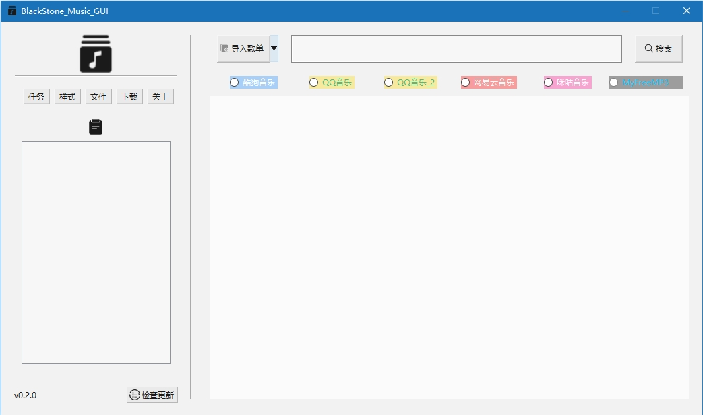

# BlackStone_Music_GUI

>:page_facing_up: 正如简介所述，这是一个简约的音乐下载工具

### :label: 说明
1. 本工具下载音乐使用的是[api](http://ovooa.caonm.net/)的接口
2. GUI使用Python自带的tkinter库进行制作，相对来说比较简陋，所以使用了rdbende等制作的[Azure-ttk-theme](https://github.com/rdbende/Azure-ttk-theme)Tcl脚本进行美化

---
:heart: 如果喜欢本工具，就请点个:star:吧
